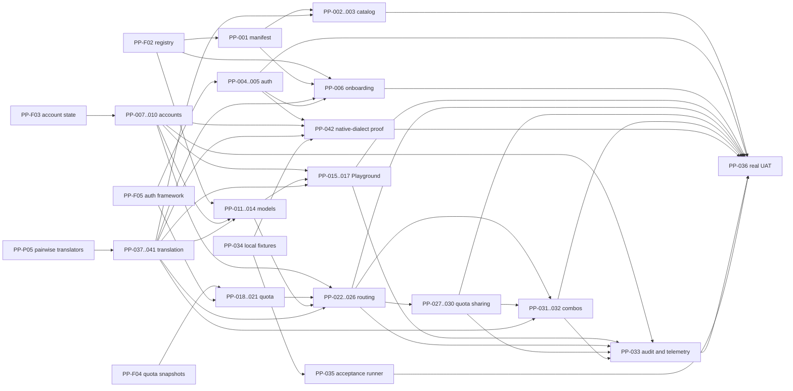

# Provider parity implementation backlog

Baseline: `feat/provider-connections-vnext` at `8ffc079`.

This backlog turns the target contract in
[`PROVIDER_PARITY.md`](PROVIDER_PARITY.md) into an executable dependency graph.
It reconciles the OmniRoute v3.8.48 audit with the five foundation commits that
landed after that audit.

The branch is unreleased. `main` and `v0.3.1` remain at `0a0536b`; no item in
this program is deployed to UAT or production.

## Status rules

Allowed feature states:

`planned -> in_progress -> implemented -> tested_locally -> uat_ready -> deployed_to_uat`

`blocked` and `deprecated` may be used from any state with a recorded reason.

- `implemented`: the scoped code or documentation exists, but its complete local
  acceptance gate has not been demonstrated.
- `tested_locally`: targeted tests and the relevant local fixture/Docker gate
  have passed with recorded commands or artefacts.
- `uat_ready`: the automated parity gate and human real-integration local UAT
  are complete, with disposable synthetic identity/project/key state.
- `deployed_to_uat`: requires an explicit deployment run plus registry or direct
  reachability evidence. A branch, image, or local container is not deployment
  evidence.

Status changes must update this file's `last_verified` timestamp and add concrete
evidence. Commit subjects alone are not completion evidence.

## Current branch snapshot

### Tested foundations

| ID | Capability | Status | Evidence and current boundary |
| --- | --- | --- | --- |
| PP-F01 | Provider parity product contract | `implemented` | `65c9b18`; `docs/PROVIDER_PARITY.md`. Target definition only. |
| PP-F02 | Validated data-driven registry manifest | `tested_locally` | `5d2c926`; `registry_manifest.go`, manifest tests. Validation exists, but the registry still has 15 entries. |
| PP-F03 | Provider account operational-state persistence | `tested_locally` | `9f09fa4`; migrations 8/10 and `provider_accounts_test.go`. No API, UI, router consumer, or production health writer yet. |
| PP-F04 | Upstream quota snapshot storage and advisory read path | `tested_locally` | `414a62d`; migrations 9/10, quota storage/API tests. No production adapter or refresh caller writes snapshots. |
| PP-F05 | General provider auth-adapter framework | `tested_locally` | `8ffc079`; auth adapter and OAuth API tests. Concrete adapters remain GitHub Copilot and OpenAI Codex only. |

### Existing partial product surfaces

| ID | Capability | Status | Current boundary |
| --- | --- | --- | --- |
| PP-P01 | Provider hub and connection lifecycle | `implemented` | Search/filter/connect/refresh/repair/delete exist. Onboarding is a single dialog and there is no provider detail route. |
| PP-P02 | Project-scoped Playground | `implemented` | Safe non-streaming keyless request path exists. No provider/model deep link, selected key/account, streaming, or logs tab. |
| PP-P03 | Models and endpoints view | `implemented` | Read-only catalog with capability metadata. No visibility, custom IDs, aliases, compatibility policy, or Play action. |
| PP-P04 | Provider quota advisory view | `implemented` | Honest unknown/empty state exists. No adapter can populate it in production and it has no routing impact. |
| PP-P05 | Pairwise Anthropic/OpenAI/Responses/Ollama translation | `tested_locally` | Anthropic Messages and OpenAI Chat translate in both directions; Chat can adapt to Responses; Ollama performs an inline native conversion. OpenAI Chat is a hard-coded pivot, structured Responses ingress and Ollama content conversion are lossy, and Responses streaming is buffered/emulated rather than a general translation matrix. |

## Non-negotiable constraints

1. Preserve the existing downstream project/key quota, IAM, audit, usage, SSO,
   encryption, and API-adaptation behavior.
2. Unknown upstream quota remains unknown. It is never inferred from gateway
   traffic and never converted to zero, full, or exhausted.
3. Service principals never own, select, or borrow human subscription
   credentials.
4. Browser-cookie extraction, MITM, stealth/session scraping, and undocumented
   subscription proxying remain prohibited.
5. Provider instances, catalogs, quota snapshots, and routing state that depend
   on a credential must be isolated by connection ID and credential revision,
   not only by provider or principal.
6. Model overrides are stored separately from fetched catalogs so refreshes do
   not erase visibility, alias, or compatibility policy.
7. Playground key selection uses a server-side policy projection by key ID. It
   never retrieves or reveals the key secret.
8. New logs, traces, quota metadata, and audit events are secret-free by
   construction.
9. Translation uses a typed canonical intermediate representation with
   ingress/egress adapters. No provider-specific pairwise shortcut may silently
   bypass capability, loss, policy, usage or audit handling.
10. Provider/model availability requires a registered, tested translator path
    for the ingress dialect and requested capabilities. Unsupported or lossy
    behavior is explicit before dispatch.
11. GitHub Actions remain deployment-only. Do not add per-push or per-PR Actions;
   all coding gates run locally, including Docker, before any deliberate image
   publication or deployment workflow.
12. Human UAT uses real integrations and OAuth with synthetic identities and
    disposable encrypted state. Provider/OAuth fixtures are for automated tests,
    not a substitute for real-integration UAT.
13. No push, remote branch mutation, deployment, DNS, or live infrastructure
    change is authorized by this backlog.

## Dependency map

## Execution waves

1. **Wave 0 - truth and repeatability:** PP-001, PP-004, PP-034, PP-037.
   Define provenance and translation loss policy, resolve dangling claims, and
   create the local fixture substrate before adding broad behavior.
2. **Wave 1 - translation and account kernels:** PP-038..041, PP-007..010 and
   PP-018..019, with PP-002..005 progressing in parallel. Replace the hard-coded
   OpenAI pivot with a reusable translator planner while proving one account can
   be selected, monitored, refreshed, and displayed without credential leakage.
3. **Wave 2 - provider/model journey and proof provider:** PP-006, PP-011..017
   and PP-042. Close onboarding, model management, Test-to-Playground, and one
   native non-OpenAI provider vertical through the shared translation layer.
4. **Wave 3 - account-aware routing:** PP-020..026, with PP-033 delivered
   incrementally alongside each routing behavior.
5. **Wave 4 - quota sharing and combos:** PP-027..032. Migrations precede domain
   logic; domain logic precedes API/UI.
6. **Wave 5 - acceptance:** PP-035..036. Close every contract gate locally,
   complete human real-integration UAT, then prepare a release decision.

## Backlog

### A. Catalog, authentication, and onboarding

| ID | Deliverable | Status | Depends on | Acceptance evidence |
| --- | --- | --- | --- | --- |
| PP-001 | Provider provenance and manifest invariants | `planned` | PP-F02 | Every entry has official provenance and verification evidence; request/response/stream dialect and translator IDs are declared; unresolved auth/quota/translator IDs fail closed or are absent; validation tests cover collisions, risk notices, URLs, and adapter references. |
| PP-002 | Direct and compatible provider catalog batch | `planned` | PP-001, PP-041 | Curate direct vendors plus OpenAI/Anthropic-compatible services from official docs; all entries pass fixture-backed manifest/runtime/translation tests. Human real-integration UAT records one disposable smoke per runtime family under PP-036 rather than embedding live credentials in PP-035. |
| PP-003 | Aggregator, cloud, local, and no-auth catalog batch | `planned` | PP-001, PP-002, PP-041 | Combined catalog reaches at least 100 independently curated text/coding templates and covers the contract's six provider families without adding excluded modalities or interception providers. |
| PP-004 | Auth-adapter policy and registration gate | `planned` | PP-F05 | Available OAuth/import entries resolve to a registered adapter; yellow flows are disabled by default, human-only, warning-gated, and audited; red flows cannot register. |
| PP-005 | Approved official OAuth/import adapter tranche | `planned` | PP-004 | Add only operator-approved documented flows; each adapter has local fixture tests and one real login using a synthetic human. Adapter selection is an explicit approval boundary. |
| PP-006 | Four-stage guided onboarding | `planned` | PP-F02, PP-001, PP-004, PP-041, PP-P01 | Type -> provider -> credentials/import -> validated result; supports API key, custom-compatible, official OAuth, and approved import fields; result shows transport and translation compatibility; base URL/region/owner inputs reach existing validated APIs; credentials remain write-only. |

### B. Provider accounts and connection-bound runtime

| ID | Deliverable | Status | Depends on | Acceptance evidence |
| --- | --- | --- | --- | --- |
| PP-007 | Safe provider-account projection API | `planned` | PP-F03 | Admin and owner-scoped APIs join connection metadata with account state, quota freshness, expiry, tier, and default/priority status without returning ciphertext, token payloads, or token-derived identifiers. |
| PP-008 | Account mutations and provider detail console | `planned` | PP-007, PP-P01 | Dedicated provider route lists multiple accounts and supports default, priority, enable/disable, revoke, and approved proxy-reference changes. Untracked health is labelled unknown, never healthy by implication. |
| PP-009 | Explicit connection-bound provider factory and cache isolation | `planned` | PP-F03 | Runtime can build a provider for an exact connection ID; caches include connection ID and credential revision; rotation/revocation invalidates provider, catalog, and quota state atomically. |
| PP-010 | Request success/failure health and cooldown feedback | `planned` | PP-009 | Real request outcomes call account success/failure writers with monotonic event ordering; cooldown and recovery are deterministic; concurrent and stale-result tests prevent older events overwriting newer state. |

### C. Model management

| ID | Deliverable | Status | Depends on | Acceptance evidence |
| --- | --- | --- | --- | --- |
| PP-011 | Additive model-override schema and API | `planned` | PP-F02, PP-009, PP-041 | Persist provider/account scope, real model ID, visibility, display label, custom IDs/aliases, source/target dialect, translator capability state, supported endpoints, and parameter policy separately from `catalog.json`; empty and upgraded DB migrations are idempotent. |
| PP-012 | Visibility, custom-ID, and alias enforcement | `planned` | PP-011 | Hidden models do not appear in `/v1/models`, admin/user model APIs, native-name resolution, manual routes/endpoints, combos, or quota virtual models; aliases resolve deterministically without changing the upstream model ID. |
| PP-013 | Compatibility and parameter-policy engine | `planned` | PP-011, PP-039 | Blocked/allowed parameters and source/target dialect compatibility are enforced server-side; opt-in unsupported-parameter learning accepts only explicit upstream 400 evidence and records an audit event. |
| PP-014 | Provider-scoped model management UI | `planned` | PP-011, PP-012, PP-013, PP-P03 | Import/sync, copy, hide/show, custom ID/alias, compatibility, parameter policy, and Play actions are available from provider detail; console tests cover mutation and refresh persistence. |

### D. Test-to-Playground

| ID | Deliverable | Status | Depends on | Acceptance evidence |
| --- | --- | --- | --- | --- |
| PP-015 | Test/Play navigation contract and probe relabel | `planned` | PP-P01, PP-P02, PP-P03, PP-014 | Provider Test opens provider-scoped Playground; model Play opens it with the exact visible/allowed model selected; the existing catalog probe is renamed Refresh/Health and never presented as end-to-end Test. |
| PP-016 | Gateway-key and provider-account execution context | `planned` | PP-007, PP-009, PP-015 | Admin may select owner, project, active key ID, account, model, or route; portal remains signed-in-owner scoped; selected key policies are enforced through server-side projection without revealing a secret. |
| PP-017 | Streaming Playground and correlated logs | `planned` | PP-015, PP-016, PP-040 | Streaming and non-streaming share the normal gateway path and selected translation plan; each run returns a request/correlation ID, latency, usage, selected account/provider/model, translation loss state, fallback trace, and secret-free scoped logs. |

### E. Upstream quota

| ID | Deliverable | Status | Depends on | Acceptance evidence |
| --- | --- | --- | --- | --- |
| PP-018 | Quota-adapter runtime, refresh lifecycle, and fail-closed manifest wiring | `planned` | PP-F04, PP-F05, PP-001 | Startup registers concrete adapters; manual refresh invokes the manifest-selected adapter and persists with credential-revision guards; optional scheduled refresh has bounded timeouts/backoff; dangling adapter IDs are rejected or removed. |
| PP-019 | GitHub Copilot quota adapter | `planned` | PP-018 | Normalizes verified premium/chat/completion windows, tier, remaining, reset, source, confidence, and freshness from the owner-private connection; fixture tests redact token-shaped upstream fields; real UAT matches the provider view. |
| PP-020 | OpenAI Codex quota adapter | `planned` | PP-018 | Normalizes verified Codex credit/session windows with the same security and freshness guarantees; unsupported/unknown fields remain unknown; real UAT matches the provider view. |
| PP-021 | Per-model/account minimum-remaining thresholds | `planned` | PP-011, PP-018 | Additive schema/API/UI stores threshold dimension and value; stale or unknown quota treatment is explicit; threshold evaluation is deterministic and feeds routing without altering downstream key/project limits. |

### F. Account-aware routing

| ID | Deliverable | Status | Depends on | Acceptance evidence |
| --- | --- | --- | --- | --- |
| PP-022 | Routing candidate and safe decision model | `planned` | PP-009, PP-012, PP-F03, PP-F04, PP-041 | Candidate includes provider, visible/allowed model, connection, translator plan, health, cooldown, priority, quota, cost, and recent-use facts; hidden/disallowed models and incompatible translation paths are excluded before dispatch; decision traces contain IDs and reasons but no secrets; unknown quota behavior is explicit per strategy. |
| PP-023 | Fixed account plus priority/failover selection | `planned` | PP-010, PP-022 | Routes can pin an account or select by priority while preserving current default-connection behavior for legacy routes; failures update health and fallback to eligible accounts deterministically. |
| PP-024 | Balanced account strategies | `planned` | PP-023 | Weighted, round-robin, power-of-two-choices, least-used, and last-known-good pass deterministic concurrency tests and never select disabled, revoked, cooling, or policy-ineligible accounts. |
| PP-025 | Quota and cost strategies | `planned` | PP-021, PP-023 | Cost-first, reset-aware, and headroom use fresh verified inputs; stale/unknown data follows configured deterministic fallback; threshold exclusions and reset transitions are tested. |
| PP-026 | Route/endpoint strategy API and console editor | `planned` | PP-012, PP-023, PP-024, PP-025 | Existing ordered failover remains backward compatible; editor supports fixed/dynamic account selection and strategy parameters; hidden/disallowed models cannot be saved or executed; invalid or ambiguous configurations are rejected atomically. |

### G. Quota sharing and automatic combos

| ID | Deliverable | Status | Depends on | Acceptance evidence |
| --- | --- | --- | --- | --- |
| PP-027 | Quota-pool and member schema migrations | `planned` | PP-F03, PP-F04 | Additive pool/member/window/virtual-model tables and indexes migrate from empty and migration-10 databases twice without drift; no existing table or column is dropped or renamed. |
| PP-028 | Work-conserving allocation ledger | `planned` | PP-027 | Percent/request/token/cost dimensions support 5-hour, hourly, daily, weekly, and monthly windows; weights, per-key caps, borrowing, and hard provider/account caps are transactionally enforced. |
| PP-029 | Pool enforcement and virtual-model namespace | `planned` | PP-023, PP-025, PP-028 | `quota/<group>/<provider>/<model>` resolves through the selected pool/account; exclusive keys see only allowed virtual models; pool rules compose with stricter existing key/project policies. |
| PP-030 | Quota-pool API, console, and borrow/cap telemetry | `planned` | PP-027, PP-028, PP-029 | Wizard selects account, dimensions, keys, weights/caps, and exclusivity; UI shows secret-free allocation, borrowing, utilization, and cap-hit evidence. |
| PP-031 | Runtime-derived automatic combo templates | `planned` | PP-012, PP-022, PP-023, PP-024, PP-025, PP-041 | Connected capabilities and translator paths produce coding, reasoning, fast, chat, vision, free, and premium templates without embedding account credentials; unavailable templates are omitted with an explicit reason. |
| PP-032 | Combo API and console editor | `planned` | PP-026, PP-031 | Operator may inspect materialized candidates, choose fixed/dynamic accounts, and configure response validation, system prompt, tool filters, context, and queue guidance; safe cascade trace is visible. |

### H. Observability, local gates, and UAT

| ID | Deliverable | Status | Depends on | Acceptance evidence |
| --- | --- | --- | --- | --- |
| PP-033 | Account-routing, translation, quota, and sharing audit/telemetry views | `planned` | PP-010, PP-017, PP-023, PP-029, PP-032, PP-041 | Typed events cover translator plan/loss state, account decisions, health/cooldown transitions, quota refresh, allocation/borrow/cap-hit, and combo materialization; payload tests reject credential-shaped values; console views require no DB access. |
| PP-034 | Disposable local protocol/provider/OAuth/quota fixture stack | `planned` | PP-F01 | Local compose/profile or scripts seed synthetic principals, projects, memberships, keys, multiple accounts, models, protocol request/response/stream fixtures, quota windows, and OAuth/provider fixtures on the project's assigned host-port range; teardown removes disposable encrypted state. |
| PP-035 | Contract-mapped local acceptance runner | `planned` | PP-034, PP-040 | One local command runs Go tests, translator matrix/golden/fuzz tests, console lint/test/build/dist checks, migrations from empty/upgraded DBs, Docker smoke, and assertions mapped one-to-one to the eleven contract UAT gates. It does not invoke GitHub Actions. |
| PP-036 | Human real-integration UAT and release closure | `planned` | PP-003, PP-005, PP-006, PP-008, PP-010, PP-014, PP-017, PP-019, PP-020, PP-021, PP-026, PP-030, PP-032, PP-033, PP-035, PP-042 | Use real OAuth/providers with synthetic identities in disposable local Docker; verify `/v1/models`, Chat, Responses, Messages, cross-dialect translation, account routing, quota, sharing, audit, an Antigravity-first or approved native-dialect substitute proof, and teardown; refresh product docs and release notes before any separately approved UAT deployment. |

### I. Protocol translation and provider admission

These IDs were appended to preserve the stability of PP-001..036, but execute in
Waves 0-2 because broad provider admission depends on them.

| ID | Deliverable | Status | Depends on | Acceptance evidence |
| --- | --- | --- | --- | --- |
| PP-037 | Translation capability matrix and loss policy | `planned` | PP-P05 | Enumerate OpenAI Chat, OpenAI Responses, Anthropic Messages, Ollama native and each new provider dialect across request, response, stream, tools, multimodal, reasoning, structured-output, usage, stop and error features. Every matrix cell is exact, explicitly lossy, or unsupported; structured Responses input flattening, Ollama content stringification and buffered/fake-stream behavior are recorded explicitly. |
| PP-038 | Typed canonical request/response/stream representation | `planned` | PP-037 | Introduce typed canonical messages, content blocks, tools/results, controls, usage, errors and stream events, then migrate the `Provider` interface, router and API/provider boundaries incrementally behind compatibility shims. Provider-specific payload maps cannot escape adapter boundaries; round-trip and fuzz tests cover malformed/unknown fields. |
| PP-039 | Translator registry and compatibility planner | `planned` | PP-038 | Register ingress decoders and provider egress/response/stream adapters around the canonical representation, avoiding pairwise M-squared converters. Planner reports exact/lossy/unsupported paths and rejects unsupported capability combinations before provider dispatch. |
| PP-040 | Seed-adapter migration and conformance suite | `planned` | PP-039, PP-P05 | Move OpenAI Chat, OpenAI Responses, Anthropic Messages and Ollama native behavior behind the registry; preserve existing supported behavior; replace structured Responses input flattening, Ollama content stringification and buffered stream emulation where parity is claimed; golden tests cover tools, images, reasoning, structured output, usage, errors and streaming in both directions. |
| PP-041 | Translation-aware provider/model admission | `planned` | PP-F02, PP-001, PP-039, PP-040 | Registry entries and model rows declare native dialect/capabilities; `available` requires auth, transport, discovery and a tested translator path; `/v1/models`, Playground, routes and combos expose only compatible targets or explicit loss metadata for the selected ingress dialect. |
| PP-042 | Antigravity-first native-dialect proof through the shared translator | `planned` | PP-004, PP-005, PP-006, PP-008, PP-009, PP-018, PP-034, PP-041 | Attempt Antigravity only through an operator-approved official Google flow; implement the native transport/translator, owner-private connection, model discovery, provider detail and verified quota when available. If no approved flow is available, record the Antigravity subcase as blocked and complete this item with another operator-approved native non-OpenAI dialect provider. Real local-Docker UAT must prove Chat, Responses and Messages clients use the shared path without browser-cookie/MITM or provider-specific bypasses. |

## Required UAT evidence mapping

| Contract gate | Backlog evidence |
| --- | --- |
| Broad provider search and guided onboarding | PP-001..006 |
| API key, official OAuth, and risk-gated import | PP-004..006 |
| Exact/lossy/unsupported many-to-many protocol translation | PP-037..041 |
| Multiple accounts, health, cooldown, default, and priority | PP-007..010, PP-023 |
| Model refresh, visibility, custom IDs, and compatibility | PP-011..014 |
| Provider/model Test to selected Playground | PP-015..017 |
| Verified quota and threshold account exclusion | PP-018..021, PP-025 |
| Weighted quota sharing, borrowing, and hard caps | PP-027..030 |
| Account-aware strategy selection and fallback | PP-022..026 |
| Secret-free audit, usage, and routing traces | PP-017, PP-022, PP-030, PP-033 |
| Application consumption through Models, Chat, Responses, and Messages | PP-035..042, with Antigravity-first or approved native-dialect substitute proof |

## Recommended first implementation slice

The first implementation sequence after backlog approval should build the
high-leverage translation foundation before multiplying provider-specific code:

1. PP-034 minimal protocol/provider fixture stack.
2. PP-037 translation capability matrix and loss policy.
3. PP-038 typed canonical request/response/stream representation.
4. PP-039 translator registry and compatibility planner.
5. PP-040 migrate the existing OpenAI Chat, Responses, Anthropic and Ollama
   translators behind conformance tests.
6. PP-041 enforce translation-aware provider/model admission.

The account/quota vertical PP-018 -> PP-019 -> PP-007 -> PP-008 can proceed in
parallel once PP-034 exists. PP-042 is the Wave 2 proof after its auth,
onboarding, account and quota-runtime dependencies are ready; it is not part of
the translation-kernel slice. Neither stream should claim account-aware routing
before PP-009/010 and PP-022/023 land.

## Future-release backlog

| ID | Scope | Status | Reason |
| --- | --- | --- | --- |
| PP-FUT01 | Fusion, pipeline, context-relay, context-optimized, strict-random, and other advanced routing strategies | `planned` | Deliberately after the minimum strategy set is proven. |
| PP-FUT02 | WebSocket live cascade visualization and advanced queue/concurrency simulation | `planned` | Useful polish, not a parity acceptance gate. |
| PP-FUT03 | Provider catalog beyond the 100-entry acceptance gate | `planned` | Continue official-doc curation without blocking the current milestone. |
| PP-FUT04 | Image, video, search, web-fetch, and unrelated non-text provider expansion | `planned` | Separate modality release; current milestone focuses on text/coding plus existing audio support. |
| PP-FUT05 | Browser-cookie, MITM, stealth/session scraping providers | `blocked` | Prohibited by the provider expansion security policy. |
| PP-FUT06 | Agent bridges, cloud agents, IDE interception, and plugin marketplace | `blocked` | Outside this gateway's approved product boundary. |
| PP-FUT07 | Remote UAT deployment | `blocked` | Requires a separate explicit deployment approval after PP-036. |
| PP-FUT08 | Additional native dialects beyond the Antigravity-first/native proof | `planned` | Add by provider-coverage leverage through the shared translator registry, never as isolated pairwise converters. |

## Maintenance rule

At every implementation commit or release:

1. update the affected item status and evidence;
2. keep incomplete/deferred scope in this versioned backlog;
3. refresh `PROVIDER_PARITY.md`, relevant operational docs, known limitations,
   and release notes;
4. do not mark `uat_ready` from unit tests alone or `deployed_to_uat` from a
   branch/image/local container.
